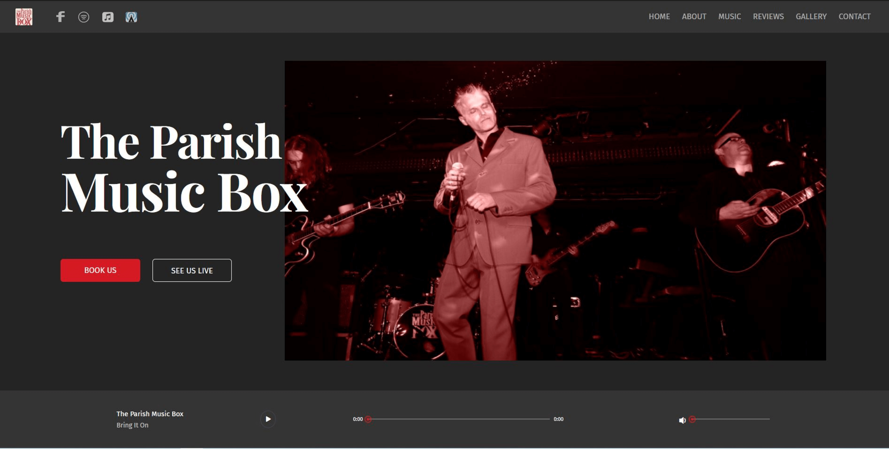

## Table of contents

- [Overview](#overview)
  - [The challenge](#the-challenge)
  - [Screenshot](#screenshot)
  - [Links](#links)
- [My process](#my-process)
  - [Built with](#built-with)
  - [What I learned](#what-i-learned)
  - [Continued development](#continued-development)
  - [Author](#author)

## Overview

This is the website for the English rock/alt. country band, The Parish Music Box

### The challenge

I was approached by the band to design and develop a website for them.

With a website the band wanted to:

- Have a showcase for any potential bookers in the London/UK nationwide pub and club circuit to see and hear them.
- They really enjoy performing live and they want to do more of it! A landing page that ads or social networks can link to can help with this!

### Screenshot

### Links

- Live Site URL: https://www.theparishmusicbox.com

## My process in a nutshell

- Had an initial brainstorming session with the band where I collected all the information needed. From that I came up with 2 user personas, one for the booker and one for the general gig goer.
- I came up with a list of content types and grouped them together.
- I followed the best UI design practices, starting with sketches then wireframing, high-fidelity design and user testing.
- Branding in terms of typography, colour, imagery and layout.
- For development I followed the Mobile-first approach. I used CSS resets and CSS variables, then set global styles, utility classes, typography, and layouts for each section.
- I mostly used CSS Grid for the layout and Flexbox for the smaller components.
- Javascript added for the mobile/tablet navigation, the streaming of songs in the Playlist and the carousel.

### Designed in 
- Figma

### Built with

- Semantic HTML5 markup
- CSS resets
- CSS custom properties
- Utility classes and reusable components
- Flexbox
- CSS Grid
- Mobile-first workflow
- Javascript

### What I learned

This was a great practice in doing a project from scratch. I designed and coded the site all by myself and by doing that I learnt a lot!

### Continued development

I will continue to update the site as needed. I will add any new information, songs in the playlist and live gig updates.

## Author

- Website - https://www.annie-indreiten.com/
- Github – https://github.com/AnnieCat73
- LinkedIn - https://www.linkedin.com/in/annieindreitendeveloper/
